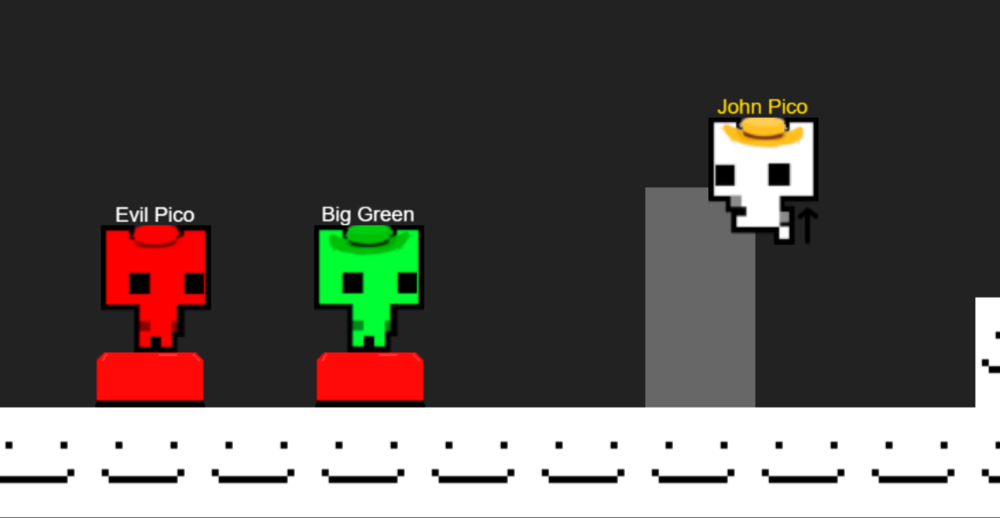

<div align="center">

# Web Park



### An online multiplayer co-op game inspired by pico park
### Currently, in early development
$\color{gray} \text{We will not be using pico park character, they are just placeholders!!!}$

---

</div>

<br>

## Current features
- Lobby system with joining using a code, data check, waiting for everyone to ready up, and lobby info display
- Custom player colors, names
- Basic sound effects
- Game synchronization
- Movement
- Physics
- Different sprites for different actions
- _Less_ basic main menu
- Basic entities
- Level loading from LDtk
- Camera system that keeps all player on screen at once
- Basic Hud/Ui

## Planned features
- Actual ~~not stolen~~ non placeholder sprites 
- More entities (for ex. moving platform)
- Level changing
- Better feeling movement
- Entity updating clientside
- FINALLY DECIDE ON ART DIRECTION

<br>

## How it was made

### The people:
The game is being developed by 2 people
- Pysia20 : all Frontend / client side stuff, so rendering, sending inputs, animations, menus, CSS etc. and in the future art
- LLoydowski: all Backend / server side stuff, so physics, networking, server set up, entities/objects etc.

We are desigin the game together

<br>

### What we used:
Core :
- TypeScript as the main language
- pnpm workspaces for separating server, client and shared

Frontend :
- Vanilla HTML and CSS for the websites
- WebStorm for coding _(also the thing you are reading right now)_
- GIMP for making images
- Audacity for a _very lil bit_ of audio editing
- PixiJS for rendering
- Socket.io Client for communicating with the server
- Howler.js for audio

Backend:
- Node.js
- Express
- Socket.io
- Zod
- UUID
- Nginx
- Visual Studio Code for coding

<br>

## How to edit or run the project

If you don't have pnpm its technically not required we **highly** recommend installing it since that's what the project was and this guide made on

Firstly download all the files and open them in your IDE, then run this command to install all the dependencies

```bash
pnpm install
```

Then to lunch the server:

```bash
pnpm --filter server dev
```

And the client:

```bash
pnpm --filter client dev  
```

You also need to uncomment the proxy in client/vite.config.ts to allow the client to connect to the server (unless you know how to use nginx)

And now everything _~~should~~_ work!

<br>

## AI Disclosure
Since most of the tools here are entirely new to us, AI was used to help with learning and exploring them (ex. how to show a sprite using Pixi, how to play a sound effect with howler etc.) and general coding help (ex. how to use grid in CSS, how to tint an image in CSS)